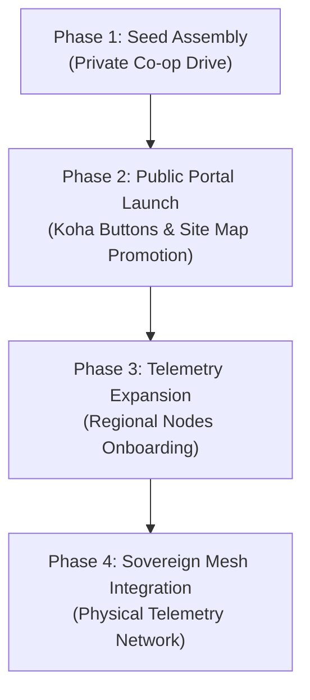

# Strategic Marketing & Capital Plan: The Sovereign Contributor Model
**Document Ref:** D9-STRAT-EXP-001  
**Project:** Fluid Motion of the Future  
**Security Status:** Public / Co-op Distribution  

---

## 1. Executive Summary: The Paradigm Shift
Decentralization has historically suffered from dependency on centralized cloud infrastructure and traditional currency grids. **Fluid Motion of the Future** proposes a radical alternative: a decentralized, offline-first ecosystem of creative and operational nodes running on a synchronized temporal framework. 

This document frames our fundraising campaign not as a traditional charity or startup donation, but as an **Infrastructure Investment** in a post-grid future. Contributors do not simply fund development; they fund and claim ownership of the tools they use, building a resilient global network.

---

## 2. Core Value Propositions

### 2.1 The "Dragon 9" Catalyst (Temporal Sovereignty)
The base scheduling layer of our network abandons standard Gregorian time in favor of the **Dragon 9 Metric Temporal Standard**:
* **The 54-Minute Hour**: Standardizes focused attention cycles.
* **The 26.66-Hour Day**: Calibrates sleep, focus, and local production cycles to match physiological and energetic peaks.
By implementing this standard across all telemetry and scheduling modules, we align decentralization with human rhythms rather than cloud server CPU clocks.

### 2.2 The Sovereign Ecosystem (Offline & Private)
Every application in the suite runs **100% client-side** and is distributable via single standalone HTML blocks:
* **Decoupled Operations**: No mandatory remote databases, API limits, or registration.
* **Hardware Resilient**: Can be transferred locally via USB, mesh-nodes, or local peer-to-peer tunnels (Universal Bridge).
* **Self-Contained Value**: Users maintain direct custody of all generated assets, from wav files in the step sequencer to signed artist ledgers.

---

## 3. The "Harmony Notes" Contributor Economy
Capital allocation is incentivized via a tiered participant contribution system. Contributor tiers are verified on-chain or locally via signed crypto-ledgers.

### 3.1 Contributor Tier Structure

| Tier | Name | Target Contribution | Rewards & Utility |
| :--- | :--- | :--- | :--- |
| **Tier 1** | **Resonance Validator** | $10 - $100 | Early access beta builds, vote weight on new sub-app priorities, listing in the digital *Co-op Contributors Registry*. |
| **Tier 2** | **Sovereign Architect** | $101 - $500 | Standalone offline deployment bundle (complete suite zip), customizable node launcher script, core telemetry editor templates. |
| **Tier 3** | **Temporal Pioneer** | $501 - $2,500 | Standard physical telemetry hub sensor kit blueprint, digital signature cert validator seat, customized regional node directory listing. |
| **Tier 4** | **Node Sovereign** | $2,501+ | Voting seat on the Co-op Core Steering Council, dedicated priority integration support, priority routing status in peer-to-peer meshes. |

---

## 4. Capital Campaign Roadmap

### Phase 1: Seed Assembly (Month 1)
* **Goal**: $10,000 USD.
* **Focus**: Leverage existing co-op networks and developers.
* **Deliverable**: Release the standalone suite package (Vite templates) to Tier 2+ contributors.

### Phase 2: Public Portal Launch (Months 2 - 3)
* **Goal**: $50,000 USD.
* **Focus**: Promote sensory portals (`sound.html`, `vision.html`, `nature.html`) to public creatives and developers.
* **Strategy**: Launch sitemap-backed educational campaigns on YouTube/Substack detailing temporal mechanics (the 54-minute hour).

### Phase 3: Telemetry Onboarding (Months 4 - 6)
* **Goal**: $150,000 USD.
* **Focus**: Fund physical node development kits (Raspberry Pi/Solar setups).
* **Strategy**: Release the *Modular Business Plan Template* to help creators establish regional hubs.

---

## 5. Outreach & Marketing Tactics

1. **Sensory Portal Demos**: Stream and publish video reels showing off-grid sound production (Sequencer) and visual forensics (VDO4N6) running 100% offline in a forest setting powered by a battery pack.
2. **Koha Integration Campaign**: Place PayPal Koha links directly inside error panels and help documents, asking users: *"Keep this node offline and free from ads—support the co-op."*
3. **Temporal Workshops**: Conduct online bootcamps explaining why the 26.66-hour day increases creative productivity, targeting burnout-exhausted tech workers.
